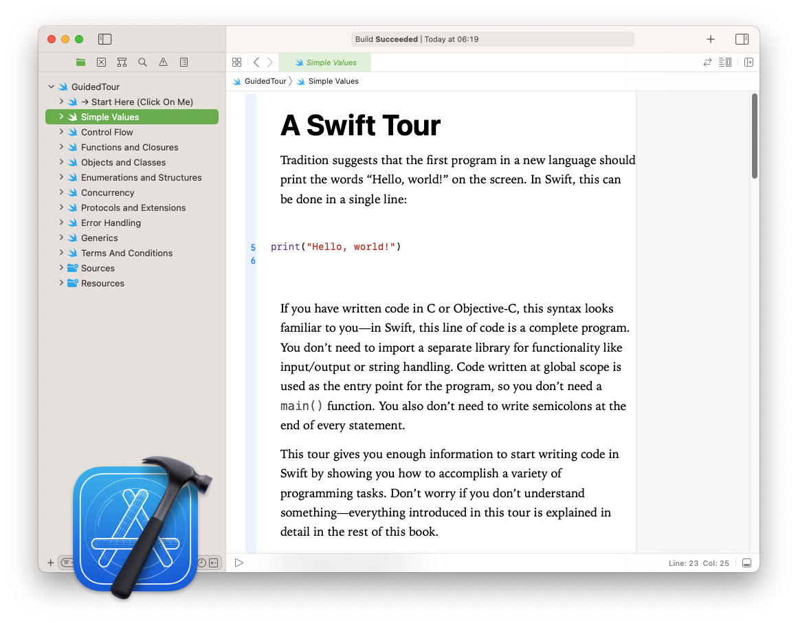

## Swift Simplified .com

[SwiftSimplified.com](https://www.swiftsimplified.com) | [Swift.org](https://docs.swift.org) | [Swift Online Course](https://www.swiftsimplified.com/the-swift-handbook)

Simplifying [the official Language Guide](https://docs.swift.org/swift-book/documentation/the-swift-programming-language/thebasics) created by Apple for students studying the Swift programming language. 

## The  Swift Guided Tour 
The official  guided tour document can be found online [here](https://docs.swift.org/swift-book/documentation/the-swift-programming-language/guidedtour/).



This repo contains and the original Swift Guided Tour Xcode playgound  uneditted  and in the original state it was published.

Open the `GuidedTour.playground` file to get started. 

### 🙋🏼‍♂️🧕🏻👨🏿‍💼👩🏼‍💼👩🏻‍💻👨🏼‍💼🧛🏻‍♀️👩🏼‍💻💁🏽‍♂️🕵🏻‍♂️🧝🏼‍♀️🦹🏼‍♀🧕🏾🧟‍♂️

## What Is It?
Apple created this guided tour to introduce and explore the Swift language.

They initially published a small Xcode playground file to be opened in Xcode and later replaced the download with online documentation. Found [here](https://docs.swift.org/swift-book/documentation/the-swift-programming-language/guidedtour/).

This is the original unedited Swift playground.

## Contents
Apple created [the Swift Guided Tour](https://docs.swift.org/swift-book/documentation/the-swift-programming-language/guidedtour/) as an introduction to some key concepts of Swift.  

The contents are below.

1. [Simple Values](https://docs.swift.org/swift-book/documentation/the-swift-programming-language/thebasics)
5. [Control Flow](https://docs.swift.org/swift-book/documentation/the-swift-programming-language/controlflow)
6. [Functions and Closures](https://docs.swift.org/swift-book/documentation/the-swift-programming-language/functions)
8. [Enumerations and Structures](https://docs.swift.org/swift-book/documentation/the-swift-programming-language/enumerations)
9. [Structures and Classes](https://docs.swift.org/swift-book/documentation/the-swift-programming-language/classesandstructures)
18. [Concurrency](https://docs.swift.org/swift-book/documentation/the-swift-programming-language/concurrency)
22. [Protocols and Extensions](https://docs.swift.org/swift-book/documentation/the-swift-programming-language/protocols)
17. [Error Handling](https://docs.swift.org/swift-book/documentation/the-swift-programming-language/errorhandling)
23. [Generics](https://docs.swift.org/swift-book/documentation/the-swift-programming-language/generics)

## Executable Code Examples

Swift playgrounds support markdown language with allow formatted intructions to be present next to executable lines of code. Each of these instructions contains editable and executable code examples.

To execute the line of code select the corresonding line number in Xcode.

## How To Become A Swift Engineer
Most companies offering iOS developer jobs require maintenance for existing products written in Swift. 

This opens new avenues for junior developers looking to penetrate the tech industry compared to previous years when developers were require to build systems from the ground up.

Today, it may be a faster strategy to learn the required computer programming language followed by code architecture, app development and how to design UI *(user interfaces)*.

We teach the main language features of Swift in our [online course](https://www.swiftsimplified.com/the-swift-handbook).

We've also converted [the official Swift Language Guide](https://docs.swift.org/swift-book/documentation/the-swift-programming-language/thebasics) into Swift playgrounds. [Take a look](https://www.swiftsimplified.com/the-language-guide).

## Why Learn Swift?
Wouldn't it make sense to build a career writing software for the worlds no.1 most profitable company? 

According to Fortune Global’s 500 list in 2020) Apple Inc was the global most profitable company reporting an annual profit of $57.41 billion US dollars. In a world with an ever increasing demand for smart devices those who have software angineering skills will never be without work. In fact, those who study the computer programming languages used by companies such as Apple, Microsoft, Google and Amazon will be sure to have a very successful and profitable career.

[Swift](https://docs.swift.org) is the new programming language chosen by Apple to write apps and the supporting frameworks for all of their iOS and macOS products. It was first released in June 2014 as a replacement for it's predecessor Objective-C. 

Start learning Swift with [SwiftSimplified.com](https://www.swiftsimplified.com)

## Recommended Learning Path

**Step 1**: Learn the Swift programming language.

**Step 2**: Learn about code architecure and how to structure code.

**Step 3**: Get a job in the tech industry maintaining existing products *(iOS apps)*.

**Step 4**: Learn how to create apps from the beginning *(known as "greenfield" projects)*.

## Recommended Studying
We recommend studying the following Swift language features to become a Swift engineer. We teach them in our [online course](https://www.swiftsimplified.com/the-swift-handbook).

1. [The Basics](https://docs.swift.org/swift-book/documentation/the-swift-programming-language/thebasics)
2. [Control Flow](https://docs.swift.org/swift-book/documentation/the-swift-programming-language/controlflow)
3. [Optionals](https://docs.swift.org/swift-book/documentation/the-swift-programming-language/optionalchaining)
4. [Functions](https://docs.swift.org/swift-book/documentation/the-swift-programming-language/functions) and [Closures](https://docs.swift.org/swift-book/documentation/the-swift-programming-language/closures)
5. [Classes](https://docs.swift.org/swift-book/documentation/the-swift-programming-language/classesandstructures)
6. [Structs](https://docs.swift.org/swift-book/documentation/the-swift-programming-language/classesandstructures)
7. [Enums](https://docs.swift.org/swift-book/documentation/the-swift-programming-language/enumerations)
8. [ARC](https://docs.swift.org/swift-book/documentation/the-swift-programming-language/automaticreferencecounting) (Automatic Reference Counting)
9. [Extensions](https://docs.swift.org/swift-book/documentation/the-swift-programming-language/extensions)
10. [Protocols](https://docs.swift.org/swift-book/documentation/the-swift-programming-language/protocols)
11. [Concurrency](https://docs.swift.org/swift-book/documentation/the-swift-programming-language/concurrency)
12. [Error Handling](https://docs.swift.org/swift-book/documentation/the-swift-programming-language/errorhandling)
13. [Generics](https://docs.swift.org/swift-book/documentation/the-swift-programming-language/generics)

## Simplifying The Official Swift Language Guide 
**The Swift Language Guide:** We took [the official Swift Language Guide](https://docs.swift.org/swift-book/documentation/the-swift-programming-language/thebasics/) created by Apple and converted it into Swift playgrounds that can be opened in Xcode. 

The official documentation introduces 28 language features and is available to download on our website as a Swift playground with 28 pages of editable and executable code examples.

**Our Online Course:** We took [the official Swift Language Guide](https://docs.swift.org/swift-book/documentation/the-swift-programming-language/thebasics/) and converted it into Swift playgrounds. We simplified it, condensing the main language features into a short course that teaches all main topics required to become a Swift engineer *(based off official documentation)*. 

We named our online course [The Swift Handbook](https://www.swiftsimplified.com/the-swift-handbook).

## The Swift Language Guide
Apple created [the Swift language guide](https://docs.swift.org/swift-book/documentation/the-swift-programming-language/thebasics) to teach the following language features.

1. [The Basics](https://docs.swift.org/swift-book/documentation/the-swift-programming-language/thebasics)
2. [Basic Operators](https://docs.swift.org/swift-book/documentation/the-swift-programming-language/basicoperators)
3. [Strings and Characters](https://docs.swift.org/swift-book/documentation/the-swift-programming-language/stringsandcharacters)
4. [Collection Types](https://docs.swift.org/swift-book/documentation/the-swift-programming-language/collectiontypes)
5. [Control Flow](https://docs.swift.org/swift-book/documentation/the-swift-programming-language/controlflow)
6. [Functions](https://docs.swift.org/swift-book/documentation/the-swift-programming-language/functions)
7. [Closures](https://docs.swift.org/swift-book/documentation/the-swift-programming-language/closures)
8. [Enumerations](https://docs.swift.org/swift-book/documentation/the-swift-programming-language/enumerations)
9. [Structures and Classes](https://docs.swift.org/swift-book/documentation/the-swift-programming-language/classesandstructures)
10. [Properties](https://docs.swift.org/swift-book/documentation/the-swift-programming-language/properties)
11. [Methods](https://docs.swift.org/swift-book/documentation/the-swift-programming-language/methods)
12. [Subscripts](https://docs.swift.org/swift-book/documentation/the-swift-programming-language/subscripts)
13. [Inheritance](https://docs.swift.org/swift-book/documentation/the-swift-programming-language/inheritance)
14. [Initialization](https://docs.swift.org/swift-book/documentation/the-swift-programming-language/initialization)
15. [Deinitialization](https://docs.swift.org/swift-book/documentation/the-swift-programming-language/deinitialization)
16. [Optional Chaining](https://docs.swift.org/swift-book/documentation/the-swift-programming-language/optionalchaining)
17. [Error Handling](https://docs.swift.org/swift-book/documentation/the-swift-programming-language/errorhandling)
18. [Concurrency](https://docs.swift.org/swift-book/documentation/the-swift-programming-language/concurrency)
19. [Type Casting](https://docs.swift.org/swift-book/documentation/the-swift-programming-language/typecasting)
20. [Nested Types](https://docs.swift.org/swift-book/documentation/the-swift-programming-language/nestedtypes)
21. [Extensions](https://docs.swift.org/swift-book/documentation/the-swift-programming-language/extensions)
22. [Protocols](https://docs.swift.org/swift-book/documentation/the-swift-programming-language/protocols)
23. [Generics](https://docs.swift.org/swift-book/documentation/the-swift-programming-language/generics)
24. [Opaque Types](https://docs.swift.org/swift-book/documentation/the-swift-programming-language/opaquetypes)
25. [Automatic Reference Counting](https://docs.swift.org/swift-book/documentation/the-swift-programming-language/automaticreferencecounting)
26. [Memory Safety](https://docs.swift.org/swift-book/documentation/the-swift-programming-language/memorysafety)
27. [Access Control](https://docs.swift.org/swift-book/documentation/the-swift-programming-language/accesscontrol)
28. [Advanced Operators](https://docs.swift.org/swift-book/documentation/the-swift-programming-language/advancedoperators)

We converted [the official Swift language guide](https://www.swiftsimplified.com/the-language-guide) into executable Swift playgrounds and made it free for our students. [Try it](https://www.swiftsimplified.com/the-language-guide) on our website. 


## [Swift Simplified .com](https://www.swiftsimplified.com)
[Website](https://www.swiftsimplified.com) | [The Swift Language Guide](https://www.swiftsimplified.com/the-language-guide) | [Our Online Course](https://www.swiftsimplified.com/the-swift-handbook) | [Extra Study Materials](https://www.swiftsimplified.com/downloads)

🛠 *..let's live a better life, by learning Swift* 

### 🧕🏻🙋🏽‍♂️👨🏿‍💼👩🏼‍💼👩🏻‍💻💁🏼‍♀️👨🏼‍💼🙋🏻‍♂️🙋🏻‍♀️👩🏼‍💻🙋🏿💁🏽‍♂️🙋🏽‍♀️🙋🏿‍♀️🧕🏾🙋🏼‍♂️

Welcome to our community of [Swift Simplified](https://www.swiftsimplified.com) students!

----------

### SEO *(Search Engine Optimisation)* - not for you 😉

```Swift
let seo = [job, iOS, Swift, programming, get a job, how to Swift, How To Get A Job Programming In Swift, Swift simplified, learn swift online, how do i learn swift, how do i learn swift online, learn swift faster, learn swift online course, swift engineer blog, become a swift engineer, swift 7, swift 8, swift 9, swift 10, learn ios, learn ios development, become an ios deeveloper, swift language, swift programming language, how do i learn official swift, official swift documentation, official swift language guide, swift language guide, the swift handbook, the swift handbook online course, swiftsimplified.com, simple swift, swift docs, ios interview, ios interview prep, ios interview practice]
```
